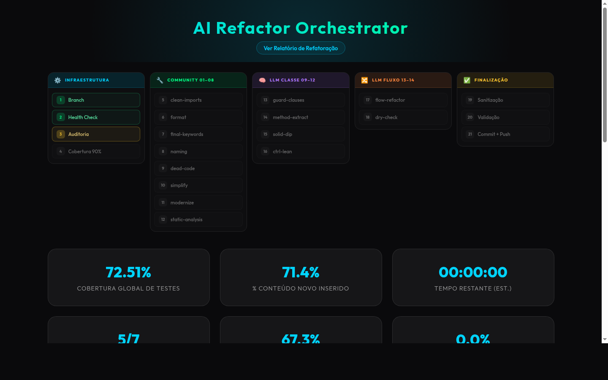
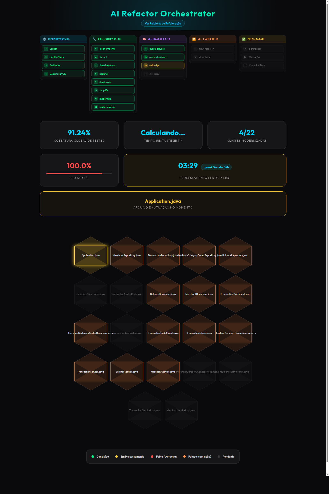
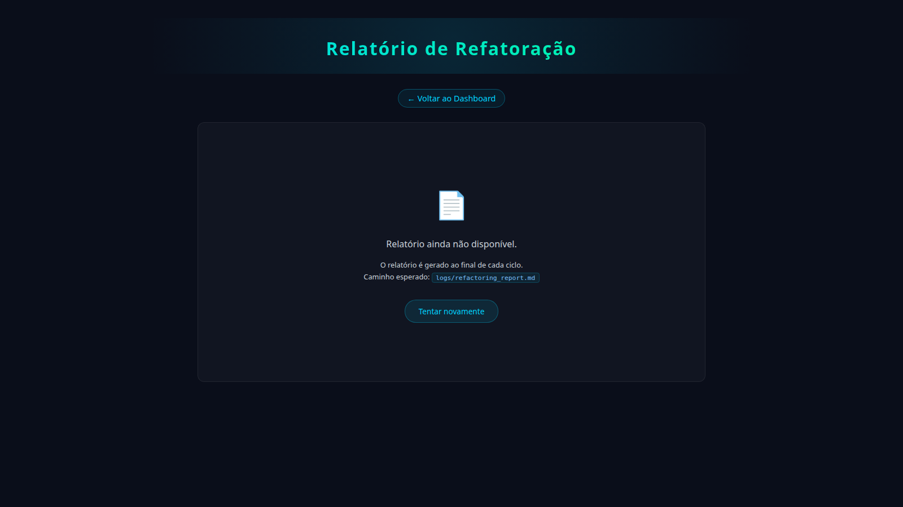

# AI Refactor Agent

Agente autônomo de refatoração Java que roda **100% localmente** via Ollama.

---

## Screenshots

### Dashboard em Tempo Real


> Pipeline de 16 fases com status ao vivo, cobertura de testes, ETC e modelo LLM ativo.

### Colmeia de Classes (Honeycomb)


> Cada hexágono representa uma classe Java. Cores: verde = refatorado, laranja = pulado (estrutural/conforme), vermelho = revertido, dourado = em processamento.

### Visualizador de Relatório


> Relatório narrativo gerado por LLM ao final de cada ciclo — acessível em `http://localhost:8000/report.html`. Aplica 16 fases de qualidade — ferramentas determinísticas + LLM método a método — mantendo o build Maven sempre verde e gerando um relatório narrativo ao final de cada ciclo.

---

## Arquitetura do Pipeline

```
main.py
  ├── HEALTH_CHECK                 → maven_test (valida estado inicial)
  ├── AUDIT_COVERAGE               → java/refactor.py (gera testes TDD até ≥ 90%)
  ├── Fases 01–14 (loop sequencial via phases/configs/*.yml)
  │     ├── tool: community        → java/community_runner.py
  │     ├── tool: llm              → java/llm_runner.py
  │     │                               ├── method_level: true  → java/method_runner.py (_run_method_level)
  │     │                               ├── class_level:  true  → java/method_runner.py (_run_class_level)
  │     │                               └── (sem flag)          → llm_runner loop por arquivo
  │     ├── tool: flow             → java/flow_runner.py
  │     └── tool: flow-dry         → java/flow_runner.py (dry_check)
  ├── AUDIT_COVERAGE_POST_DIP (S5) → java/refactor.py (segunda passagem — classes liberadas pelo solid-dip)
  ├── SANITIZATION                 → java/sanitizer.py (imports mortos, código inativo)
  ├── JAVADOC                      → java/javadoc_runner.py (Javadoc em métodos públicos)
  ├── FINAL_VALIDATION             → maven_test + JaCoCo (cobertura final)
  ├── REPORT                       → java/report_runner.py (relatório Markdown por classe)
  └── COMMIT_PUSH                  → git_utils/repo.py (branch refactor/ai-agent-automation)
```

### As 16 Fases

| # | Skill / Fase | Tool | Runner | Granularidade |
|---|-------------|------|--------|---------------|
| 01 | clean-imports | community | community_runner | arquivo |
| 02 | format | community | community_runner | arquivo |
| 03 | final-keywords | community | community_runner | arquivo |
| 04 | naming-conventions | community | community_runner | arquivo |
| 05 | dead-code | community | community_runner | arquivo |
| 06 | simplify-code | community | community_runner | arquivo |
| 07 | modernize-syntax | community | community_runner | arquivo |
| 08 | static-analysis | community | community_runner | arquivo |
| 09 | guard-clauses | llm → method | method_runner | **método** |
| 10 | method-extraction | llm → method | method_runner | **método** |
| 11 | solid-dip | llm → class | method_runner | **classe completa** |
| 12 | controller-lean | llm → method | method_runner | **método** |
| 13 | flow-refactor | flow | flow_runner | endpoint/fluxo |
| 14 | dry-check | flow-dry | flow_runner | grupo de arquivos |
| 15 | JAVADOC | — | javadoc_runner | arquivo |
| 16 | REPORT | — | report_runner | sessão completa |

---

## Refatoração Método a Método (Fases 09, 10, 12)

```
Para cada arquivo Java (excl. testes):
  │
  ├── cache.is_phase_done?       → skip
  ├── _is_structural_type?       → skip (FILE_SKIPPED — laranja no dashboard)
  │     record / interface / @Entity / @Document / DTO
  │
  └── Para cada método:
        ├── cache.is_method_done?           → skip
        ├── detect_fn(method.body)?         → padrão ausente → marcar done, skip
        │
        ├── build_method_context()
        │     └── esqueleto da classe (outros métodos como assinatura)
        │         + método alvo completo
        │
        ├── call_ai(method.full_text, dep_context=esqueleto)
        │     └── LLM devolve APENAS o método refatorado
        │
        ├── extract_method_from_response()
        ├── merge_method(código_atual, original, novo)
        ├── mvn compile -q
        │     ├── OK  → mark_method_done + FILE_ACCEPTED
        │     └── ERR → write_file(código_anterior) + FILE_REVERTED
        └── mark_phase_done(arquivo) após todos os métodos avaliados
```

## Refatoração Classe Completa (Fase 11 — solid-dip)

```
Para cada arquivo Java:
  ├── _is_structural_type? → skip
  ├── skip_compression: true (flag no yml)
  │     → envia código ORIGINAL completo ao LLM (contexto total das dependências)
  ├── call_ai(full_class)
  │     └── LLM devolve classe inteira (apenas constructor injection adicionado)
  ├── mvn compile -q
  │     ├── OK  → write + mark_phase_done + FILE_ACCEPTED
  │     └── ERR → repair loop (A1: até MAX_RETRIES tentativas com call_ai_with_correction)
  │               → esgotado: git checkout -- arquivo + FILE_REVERTED
  └── mark_phase_done
```

---

## Fase Javadoc (pós-sanitização)

```
Para cada arquivo Java de produção:
  ├── _all_public_methods_documented? → FILE_SKIPPED (already_documented)
  ├── call_ai(full_class, regras javadoc)        ← MODEL_DOC (neural-chat:7b)
  │     └── LLM adiciona /** */ onde falta — sem tocar em corpos de método
  ├── _strip_comments(new_code) == _strip_comments(original)?
  │     ├── NÃO → J1: retry com MODEL_STRUCT (qwen2.5-coder:7b) + prompt de crítica
  │     │         ├── retry aceito?   → continua para compile
  │     │         └── retry rejeitado → FILE_SKIPPED (code_structure_changed)
  │     └── SIM → continua para compile
  ├── mvn compile -q
  │     ├── OK  → FILE_ACCEPTED
  │     └── ERR → write_file(original) + FILE_REVERTED
  └── continua para próximo arquivo
```

---

## Relatório de Refatoração (pós-validação final)

```
report_runner.run_report()
  ├── Lê execution.jsonl — isola sessão atual (desde GIT_BRANCH_CREATED)
  ├── Agrupa eventos por arquivo:
  │     accepted  → fases onde FILE_ACCEPTED
  │     skipped   → fases onde FILE_SKIPPED (com motivo)
  │     reverted  → fases onde FILE_REVERTED
  ├── Serializa sumário compacto
  ├── Chama LLM (Claude → modelo local fallback)
  │     → gera relatório Markdown narrativo em Português
  │     → seções: Visão Geral, Cobertura, Classes Modificadas, Puladas, Revertidas
  ├── Fallback puro Python se LLM indisponível
  ├── Salva em logs/refactoring_report.md
  └── Salva em REFACTORING_REPORT.md na raiz do repo alvo (commitado)
```

**Visualização:** `http://localhost:8000/report.html` (link no dashboard) — renderização Markdown com tema escuro, atualização automática a cada 30s.

---

## Módulos Java

| Arquivo | Papel |
|---------|-------|
| `java/method_extractor.py` | Extrai `MethodDef` (signature, body, start/end line) sem parser AST — contagem de chaves |
| `java/class_builder.py` | `build_method_context`, `compress_done_methods`, `merge_method`, `extract_method_from_response` |
| `java/method_runner.py` | Orquestra refatoração método a método e classe completa; `skip_compression` flag para solid-dip |
| `java/llm_runner.py` | Dispatch → method_runner ou loop file-level; `_is_structural_type()` |
| `java/flow_runner.py` | Refatoração por cadeia de endpoint; DRY check; repair loop; emite eventos exec_logger |
| `java/flow_mapper.py` | Análise estática — mapeia endpoints, resolve interface→impl |
| `java/community_runner.py` | Executa ferramentas OpenRewrite / GJF / PMD |
| `java/refactor.py` | Geração de testes TDD — `generate_tests()` com repair loop e JaCoCo |
| `java/llm_reviewer.py` | Revisa diff pós-fase com `review_criteria` → APPROVE/REJECT/SKIP |
| `java/javadoc_runner.py` | Insere Javadoc em métodos públicos; heurística de detecção de cobertura existente |
| `java/report_runner.py` | Gera relatório Markdown narrativo por classe; fallback estruturado sem LLM |

---

## Cache em Dois Níveis

```
memory/cache.py
  ├── is_phase_done(file, phase)              → arquivo inteiro já processado
  ├── mark_phase_done(file, phase)
  ├── is_method_done(file, method_key, phase) → chave = "file_path#signature_normalizada"
  ├── mark_method_done(file, method_key, phase)
  └── done_method_keys(file, phase)           → usado pelo compress_done_methods
```

---

## Skills LLM

Todas em `~/.claude/skills/<nome>/SKILL.md`. Carregadas via `load_skill(name, section="LLM INSTRUCTIONS")` e injetadas como instrução de prompt nas LLMs locais (Ollama).

### Mapa de execução

| Momento | Skill | Onde é carregada | Trigger |
|---------|-------|-----------------|---------|
| Toda chamada de refatoração | `java-refactor-context` | `ai/prompt.py → _build_task()` | sempre — base de instrução para qualquer fase LLM |
| `AUDIT_COVERAGE` (pré-refatoração) | `java-tdd-unit-test` | `java/refactor.py → generate_tests()` | cobertura JaCoCo < 90% |
| Fase 09 | `java-guard-clauses` | `method_runner._run_method_level()` | detecta ≥ 3 níveis de `if` aninhado |
| Fase 10 | `java-method-extraction` | `method_runner._run_method_level()` | detecta método > 30 linhas |
| Fase 11 | `java-solid-dip` | `method_runner._run_class_level()` | detecta `new ConcreteClass()` hardcoded |
| Fase 12 | `java-controller-lean` | `method_runner._run_method_level()` | detecta lógica de negócio em `@RestController` |
| Fase 13 | `java-flow-refactor` | `flow_runner.py` | todos os endpoints mapeados pelo `flow_mapper` |
| Fase 14 | `java-dry-extraction` | `flow_runner.dry_check()` | grupos de arquivos com padrões repetidos |
| `AUDIT_COVERAGE_POST_DIP` (S5) | `java-tdd-unit-test` | `main.py → generate_tests()` | após fases 01–14 — classes com field injection convertidas pelo solid-dip |
| Fase 15 | `java-javadoc` | `javadoc_runner.py` | método público sem `/** */` detectado |
| Repair loop (fases 09–14) | `java-repair-guide` | `java/refactor.py → call_ai_with_correction()` | compilação Maven falha após geração LLM |

### Parâmetros das fases LLM (09–12)

| Skill | yml | method_level | class_level | skip_compression | detect_pattern |
|-------|-----|:---:|:---:|:---:|----------------|
| `java-guard-clauses` | `09_guard_clauses.yml` | ✓ | — | — | `nested_if` |
| `java-method-extraction` | `10_method_extraction.yml` | ✓ | — | — | `long_method` |
| `java-solid-dip` | `11_solid_dip.yml` | — | ✓ | ✓ | `concrete_new` |
| `java-controller-lean` | `12_controller_lean.yml` | ✓ | — | — | `controller_logic` |

> **solid-dip** usa `skip_compression: true` — envia a classe inteira ao LLM (sem compressão de métodos) para preservar o contexto completo de dependências. Proibições absolutas: nunca criar interfaces, nunca alterar assinaturas, nunca adicionar lógica — apenas substituir `new ConcreteClass()` por injeção via construtor.

> **java-refactor-context** é a skill de contexto base: toda chamada de refatoração LLM (fases 09–14 e repair loop) começa com as instruções dessa skill como sistema de regras globais, antes das regras específicas da fase.

### Tipos ignorados em todas as fases LLM

`_is_structural_type()` em `llm_runner.py` detecta e emite `FILE_SKIPPED` (laranja neon no dashboard) para: records, interfaces, `@Entity`, `@Document`, `@Table`, `*Dto.java`, `*DTO.java`, `*Request.java`, `*Response.java`, qualquer arquivo em `/dto/`. Zero tokens consumidos nesses tipos.

---

## Dashboard em Tempo Real

`dashboard.html` atualizado a cada 10 segundos com dados de `logs/execution.jsonl`.

| Cor do hexágono | Significado |
|----------------|-------------|
| Cinza | Pendente (ainda não processado) |
| Dourado pulsante | Em processamento agora |
| Laranja neon | Pulado (record/interface/DTO/entity — sem lógica de negócio, ou código já conforme) |
| Verde | Concluído com sucesso |
| Vermelho | Falha / autocura (compile falhou, arquivo revertido) |

**Funcionalidades do dashboard:**
- **ETC ao vivo**: conta regressiva; após `PIPELINE_COMPLETE` mostra duração real (`✓ 3h 44m`) e muda label para "Duração Total"
- **Card de classe ativa**: mostra arquivo e timer; ao finalizar mostra `✓ Pipeline concluído` em verde
- **Tooltips de hexágono**: hover mostra `Arquivo.java::assinaturaDométodo` para fases método a método
- **Fase COMMIT_PUSH**: marcada como `done` automaticamente ao final
- **Link para relatório**: botão "Ver Relatório de Refatoração" no topo abre `report.html`

```bash
# Servidor do dashboard (main.py inicia automaticamente)
python3 -m http.server 8000
# Dashboard:  http://localhost:8000/dashboard.html
# Relatório:  http://localhost:8000/report.html
```

---

## Técnicas de Qualidade Integradas

- **Reviewer Pattern**: diff pós-fase avaliado por `llm_reviewer.py` com critérios específicos por skill → APPROVE/REJECT/SKIP
- **TDD Unit Test Skill**: gera testes autonomamente antes da refatoração preservando comportamento atual; gate de 90% de cobertura
- **JaCoCo Guardrail**: cobertura mínima ≥ 90%; alerta de regressão se cobertura cair > 1pp após refatoração
- **Repair Loop (A1)**: falha de compilação → captura erro exato → `call_ai_with_correction()` → até `MAX_RETRIES` tentativas com `_categorize_build_error()` identificando o tipo (String→BigDecimal, construtor inválido, símbolo ausente, etc.)
- **Structural Type Skip**: `_is_structural_type()` detecta records, interfaces, @Entity, @Document, DTOs — zero tokens desperdiçados
- **Controller Guard (C1)**: `controller-lean` só roda em classes `@RestController`; ServiceImpl pulados automaticamente
- **Agent Gitignore**: `_ensure_agent_gitignore()` injeta `.refactor_cache/` e `.rag_store/` no `.gitignore` do repo alvo antes de cada commit — evita arquivos internos no histórico
- **Deferred Field Injection (M7)**: detecta classes com `@Autowired` em campo sem construtor — adia geração de testes até solid-dip converter para constructor injection; `_dip_prefiltered` detecta quando solid-dip nunca vai processar e usa `@InjectMocks` imediatamente
- **Post-DIP Coverage (S5)**: segunda passagem de `generate_tests()` após todas as fases — classes que M7 adiou e que solid-dip converteu agora recebem testes com construtor injetado; classes já cobertas (≥ 90%) puladas por M8 sem custo
- **Deterministic Import Injection (S1/F1)**: `_auto_inject_missing_imports()` injeta imports ausentes deterministicamente após geração e após cada reparo; usa `_s1_imports = prod_imports + [self_import]` — o self-import (ex: `import com.caju.transactionauthorizer.document.MerchantDocument;`) é derivado do package + nome do arquivo de produção, cobrindo o caso em que a classe testada não se importa a si mesma
- **Import-Aware Repair (S2/S4)**: `_categorize_build_error()` inclui import exato ao reportar símbolo ausente; C1 vincula import ao `@Mock` correspondente no prompt, reduzindo alucinação de tipo nas gerações de teste
- **Package Guard (F2)**: após C2 validar o nome da classe no repair loop, nova checagem de package — se o LLM alterou `package` para `com.example.model` (ou qualquer valor que difira de `_test_pkg`), injeta `PACKAGE CRITICAL ERROR` em `combined_out` e força nova tentativa sem gravar o arquivo corrompido no disco
- **Surgical Assertion Fix (G1/F4)**: `_categorize_build_error()` extrai `expected: <X> but was: <Y>` do output Maven e retorna instrução cirúrgica — "find the assertion containing X and replace with Y, ONE LINE CHANGE only" — evita que o LLM reescreva o teste inteiro ao corrigir um valor errado, o que causava erros de compilação no reparo seguinte; F4 (null vs "") é caso especial do mesmo handler
- **Javadoc Retry (J1)**: quando `neural-chat:7b` (MODEL_DOC) modifica código além de comentários, `javadoc_runner.py` executa retry com `MODEL_STRUCT` (qwen2.5-coder:7b, temp=0.05) antes de rejeitar — reduz de ~11 para ~2–3 falhas `code_structure_changed` por ciclo
- **Constructor Call Hint (C1)**: `_extract_simplified_header()` em `context.py` gera `// CONSTRUCTOR CALL: new Foo(a, b)` para classes regulares com construtor explícito (não só records) — o LLM usa esse hint ao instanciar objetos nos testes, eliminando chamadas `new Foo()` sem args em `@Document`/`@Entity`
- **Repair-to-DepContext Bridge (R1)**: `_categorize_build_error()` no RECORD/CONSTRUCTOR ERROR agora instrui explicitamente: "Look in DEPENDENCY CONTEXT for `// CONSTRUCTOR CALL:` and copy that EXACT call" — fecha o loop entre o hint do dep_context (C1) e o reparo do erro (D/R1)
- **Test Timeout Margin (T1)**: `TIMEOUT_TEST` aumentado de 300s para 420s — o custo real por arquivo é ~50s (construção do KV cache do prompt no Ollama) + ~250s (geração), totalizando ~300s. Com o limite anterior o attempt 1 expirava sistematicamente para cada arquivo novo; o attempt 2 sempre sucedia porque o KV cache já estava computado. Com 420s o attempt 1 passa com margem mesmo para prompts maiores ou variação de hardware

---

## Hierarquia de Modelos

| Papel | Tamanho | Responsabilidade |
|-------|---------|-----------------|
| Ultimate | 14B+ | SOLID, arquitetura, revisão crítica |
| Advanced | 9B | Clean code, lógica de negócio, testes |
| Standard | 7B | Estrutura, nomenclatura |
| Light | 4B | Javadoc, `final`, formatação |

```bash
ollama pull qwen2.5-coder:14b   # Ultimate
ollama pull gemma4:latest        # Advanced
ollama pull qwen2.5-coder:7b    # Standard
```

---

## Requisitos

- **Ollama** rodando localmente
- **Python 3.12+**
- **Maven** + **Java 22** via SDKMAN

```bash
sdk use java 22-open   # obrigatório antes de qualquer Maven
```

## Instalação

```bash
git clone git@github.com:Emersondll/ai-refactor-agent.git
cd ai-refactor-agent
python -m venv .venv && source .venv/bin/activate
pip install -r requirements.txt
cp .env.example .env   # configurar modelos e flags
sdk use java 22-open
python main.py
```

### Parâmetros principais do `.env`

#### Modelos Ollama

| Parâmetro | Padrão | Descrição |
|-----------|--------|-----------|
| `MODEL_DOC` | `neural-chat:7b` | Javadoc e `final` |
| `MODEL_STRUCT` | `qwen2.5-coder:7b` | Estrutura e nomenclatura |
| `MODEL_CLEAN` | `gemma4:latest` | Clean code e testes |
| `MODEL_SOLID` | `qwen2.5-coder:14b` | SOLID e revisão crítica |
| `MODEL_RECOVERY` | `gemma4:latest` | Repair loop |
| `OLLAMA_BASE_URL` | `http://localhost:11434` | Endereço do Ollama |

#### Flags de execução

| Parâmetro | Padrão | Descrição |
|-----------|--------|-----------|
| `USE_AGENT_MODE` | `false` | `true` = agent loop; `false` = pipeline fixo |
| `USE_CLAUDE_FALLBACK` | `false` | Permite Claude escrever Java (manter `false`) |
| `USE_LLMLINGUA` | `false` | Comprime `dep_context` (nunca o código-fonte) |
| `USE_RAG_CONTEXT` | `false` | LlamaIndex + ChromaDB |
| `USE_MEM0` | `false` | Memória semântica entre runs |
| `USE_CONTEXT7` | `false` | Docs ao vivo via Context7 MCP |

---

## Estrutura do Projeto

```
ai/                     # Prompts, roteamento de modelos, compressão
java/
  method_extractor.py   # Extrai MethodDef sem AST
  class_builder.py      # compress / merge / build_method_context
  method_runner.py      # Runner método a método e classe completa
  llm_runner.py         # Dispatch; _is_structural_type()
  flow_runner.py        # Refatoração por fluxo; DRY check
  flow_mapper.py        # Análise estática de endpoint chains
  community_runner.py   # OpenRewrite / GJF / PMD
  llm_reviewer.py       # APPROVE/REJECT/SKIP por diff
  refactor.py           # Geração de testes TDD
  javadoc_runner.py     # Javadoc em métodos públicos
  report_runner.py      # Relatório Markdown narrativo por classe
phases/
  configs/              # 14 arquivos .yml — um por fase
agent/                  # Loop agêntico (planner + executor)
core/                   # Logger, utilitários, ExecutionLogger
memory/                 # Cache de fases e métodos
dashboard/              # data.py → dashboard_status.json (10s)
git_utils/
  repo.py               # clone, branch, commit, push, _ensure_agent_gitignore
logs/                   # execution.log, execution.jsonl, live_state.json (gitignored)
repos/                  # Repositórios clonados (gitignored)
dashboard.html          # Dashboard em tempo real
report.html             # Visualizador do relatório de refatoração
~/.claude/skills/
  java-tdd-unit-test/
  java-guard-clauses/
  java-method-extraction/
  java-solid-dip/
  java-controller-lean/
  java-flow-refactor/
  java-dry-extraction/
  java-javadoc/
```

---

## Como Usar

```bash
sdk use java 22-open
source .venv/bin/activate
python main.py
# → informe a URL ou caminho local do repositório Java
# → acompanhe em http://localhost:8000/dashboard.html
# → relatório em  http://localhost:8000/report.html
```

O agente cria branch `refactor/ai-agent-automation`, executa todas as fases, gera `REFACTORING_REPORT.md` e faz commit ao final.

---

Desenvolvido para ser o braço direito do desenvolvedor Java que busca excelência e privacidade total.
